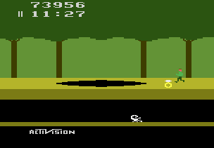

# Example #11C: Pitfall! Revisited
The Rich Presence for Pitfall! shows the time left, the number of treasures collected, the number of lives left, and the players current score.
<br>
 
```fsharp
// Pitfall!
// #ID = 11191

// $0000: [8-bit] Lives
//        bit5=1st extra life
//        bit7=2nd extra life
function Lives() => bitcount(0x000000)

// $001E: [8-bit] 00=game active
function GameActive() => byte(0x00001E)

// $0055: [BCD] Score XX0000
// $0056: [BCD] Score 00XX00
// $0057: [BCD] Score 0000XX
function ScoreX00000() => high4(0x000055)
function Score0X0000() => low4(0x000055)
function Score00X000() => high4(0x000056)
function Score000X00() => low4(0x000056)
function Score0000X0() => high4(0x000057)
function Score00000X() => low4(0x000057)

// Converts the BCD score values into Base 10 decimal
function Score()
{
    return ScoreX00000() * 100000 +
        Score0X0000() * 10000 +
        Score00X000() * 1000 +
        Score000X00() * 100 +
        Score0000X0() * 10 +
        Score00000X()
}

// $0058: [BCD] Time XX:00
//        20=out of game
// $0059: [BCD] Time 00:XX
// $005A: [8-bit] Time (miliseconds)
function TimeX00000() => high4(0x000058)
function Time0X0000() => low4(0x000058)
function Time00X000() => high4(0x000059)
function Time000X00() => low4(0x000059)
function Time0000XX() => byte(0x00005A)

// Converts the BCD time values into frames
// Note that minutes and seconds are BCD and the frames are already Base 10
function Time()
{
    return TimeX00000() * 36000 +
        Time0X0000() * 3600 +
        Time00X000() * 600 +
        Time000X00() * 60 +
        Time0000XX()
}

// $006D: [8-bit] Treasures flags 1-8 
// $006E: [8-bit] Treasures flags 9-16
// $006F: [8-bit] Treasures flags 17-24
// $0070: [8-bit] Treasures flags 25-32 
function Treasures1() => bitcount(0x00006D)
function Treasures2() => bitcount(0x00006E)
function Treasures3() => bitcount(0x00006F)
function Treasures4() => bitcount(0x000070)
function Treasures() {
    return Treasures1() +
        Treasures2() +
        Treasures3() +
        Treasures4()
}

// Example #11C - Rich Presence for Pitfall
rich_presence_conditional_display(GameActive() != 0 || Time() == 0,
    "Taking a break between adventures"
)

rich_presence_display("⏳{0} | 💳{1}/32 | 🧑x{2} | 💯{3}",
    rich_presence_value("Time", Time(), format="FRAMES"),
    rich_presence_value("Digit", Treasures()),
    rich_presence_value("Digit", Lives()),
    rich_presence_value("Digit", Score())
)
```
## {0} Time
Pitfall Harry has twenty minutes to collect all the treasures. The ```Time()``` function calculates the time left by combining Binary-Coded Decimal (BCD) values for the minutes and seconds displayed on the screen plus the number frames.  To display the time in the typical format H:MM:SS.ms the format is set to ```FRAMES```.
## {1} Treasures
Pitfall! Has 32 total treasures to collect with each being marked collected by an array of bitflags. The number of treasures collected is calculated by adding the total number of bits active in the bitflag array using the ```Treasures()``` function.
## {2} Lives
Pitfall Harry has two extra lives from the beginning of each game.  Each extra life has its own bitflag so number of extra lives is calculated by adding the bits together with the ```Lives()``` function.
## {3} Score
Starting with 2000 points the score will increase when Harry collects a treasure and decrease when Harry gets hit.  Like the time the score is a BCD value, the total score is calculated by multiplying each digit by its decimal place and adding them together with the ```Score()``` function.<br>
### Script
[Complete Example #11C with the above solution](Example_11C.rascript)<br>
### Links
[Tutorial #11](../readme.md)<br>
[Example #11A](../Example_11A.md)<br>
[Example #11B](../Example_11B.md)<br>
[Example #11C](../Example_11C.md)