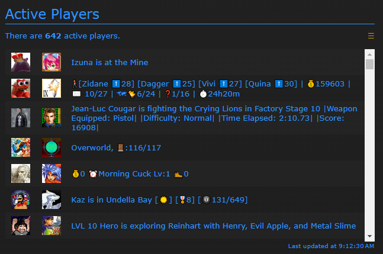

# Tutorial #11 – Rich Presence
## Overview
This tutorial will show a few examples of how to create **Rich Presence** (RP) for various types of games.  **Rich Presence** is a public facing string of text that changes dynamically based on the player’s location in the game.  If a **Rich Presence** is not defined the emulator will default to the text “Playing [Game name]”.  By defining a **Rich Presence** you give other players an idea of where they are in a game.  A bonus of using **Rich Presence** is it can expose cheaters, for example, if a player is a much higher level than they should be in the starting area.  For more information on the **Rich Presence** see the [RATools Wiki](https://github.com/Jamiras/RATools/wiki/Rich-Presence-Functions).<br>
<br>
 ## Dictionaries
A **dictionary** is a special type of data structure that organizes data by **key**/ **value** pairs.  The **key** is typically a number or a string which is converted into a **hash** that the computer uses to find where a **value** is in memory.  The **hash** function is very fast which makes **dictionaries** ideal for searching through large data sets.  For **Rich Presence**, **dictionaries** are used to convert in-game memory values to readable text.  For example, the first zone in Sonic the Hedgehog is Green Hill Zone Act 1.  By using a **dictionary** to define all the level names you could display “Green Hill Zone Act 1” in the **Rich Presence** instead of the level value of 0x0000. See the [RATools Wiki](https://github.com/Jamiras/RATools/wiki/Variables#dictionaries) for more information of how **dictionaries** works.
```fsharp
// To create a dictionary
dictionary = {
    key_1: value_1, 
    key_2: value_2,
    …
    key_n: value_n
}
// To access a dictionary value
dictionary[key] = value
```
## String Format
The **String Format** function is a common way to build a string with real memory values that are formatted for easy reading.  When defining a **Format String**, numbered curly brackets are used as placement markers to tell the computer where to insert a value.  The number in the curly brackets corresponds to the parameter number of format function starting at zero.  The format function itself is dynamic and can have as many parameters as necessary. For **Rich Presence** the **String Format** function is used to format the text to make the game memory readable. See the [RATools Wiki](https://github.com/Jamiras/RATools/wiki/Built-in-Functions#formatformat_string-parameters) for more information of how the **Format String** function works.
```format(“Parameter #1: {0}, Parameter #2: {1}, …, Parameter #n {n}, parameter_1, parameter_2, … parameter_n)``` 
## Value Expressions
The **rich_presence_value** function is used to convert a value in game memory into readable text.  The benefit of this function is that it supports multiple formats depending on the type of memory you are trying to display.  Often you will be showing the raw memory values however you can display memory as various time formats or as a floating point number. See the [RATools Wiki](https://github.com/Jamiras/RATools/wiki/Rich-Presence-Functions#rich_presence_valuename-expression-format) for a complete list of the possible formats.
## Lookup Expressions
The **rich_presence_lookup** function is used to look up the in game values from a  **dictionary**.  The in game memory is used as a **key** and it returns to matching **value**.  If the **key** is not in the **dictionary** then you can either define a fallback string, or an empty string is used if no fallback is defined.  See the [RATools Wiki](https://github.com/Jamiras/RATools/wiki/Rich-Presence-Functions#rich_presence_lookupname-expression-dictionary-fallback) for more information on dictionary look ups.
## Macro Expressions
The **rich_presence_macro** function is similar to the **rich_presence_value** function except that the macros are built-in to the Libretro library.   The biggest advantage to using macros is when the game has ASCII or Unicode strings in the memory since the macros handle the text conversion internally. See the [RATools Wiki](https://github.com/Jamiras/RATools/wiki/Rich-Presence-Functions#rich_presence_macromacro-expression) for a complete list of the possible macros.

### Links
Tutorial #11<br>
[Example #11A](Example_11A.md)<br>
[Example #11B](Example_11B.md)<br>
[Example #11C](Example_11C.md)