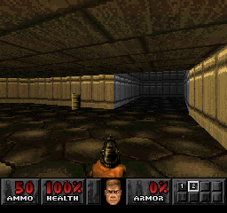

# Example #12A: Level Speedruns
Speedruns are a measure of how long it takes a player to accomplish a goal.  Most speedruns are for accomplishing a goal as quickly as possible however speedruns can have additional conditions that stipulate the difficulty level, collecting all the items, or other handicaps.  If the game is popular enough then it will have various types of speedruns listed on [Speedrun.com](https://www.speedrun.com/).  If the game isn’t listed feel free to come up with your own challenges. For the speedruns in this example the player must be on the difficulty Hurt Me Plenty (difficulty 2 of 4) or higher for the leaderboard to activate.  It is best practice to have some leaderboards that are active for the default settings before adding more complicated leaderboards.<br>
<br>
```fsharp
// Doom
// #ID = 11256

// $077E10: Map ID 1
//          00 = Main Menu
function MapId() => byte(0x077E10)

MapLookup = {
    0x0: "Main Menu",
    0x1: "Hangar",
    0x2: "Plant",
    0x3: "Toxin Refinery",
    0x4: "Command Control",
    0x5: "Phobos Lab",
    0x6: "Central Processing",
    0x7: "Computer Station",
    0x8: "Phobos Anomaly",
    0x9: "Deimos Anomaly",
    0xA: "Containment Area",
    0xB: "Refinery",
    0xC: "Deimos Lab",
    0xD: "Command Center",
    0xE: "Halls of the Damned",
    0xF: "Spawning Vats",
    0x10: "Hell Gate",
    0x11: "Hell Keep",
    0x12: "Pandemonium",
    0x13: "House of Pain",
    0x14: "Unholy Cathedral",
    0x15: "Mt. Erebus",
    0x16: "Limbo",
    0x17: "Tower of Babel",
    0x18: "Hell Beneath",
    0x19: "Perfect Hatred",
    0x1A: "Sever the Wicked",
    0x1B: "Unruly Evil",
    0x1C: "Unto the Cruel",
    0x1D: "Twilight Descends",
    0x1E: "Threshold of Pain",
    0x1F: "Entryway",
    0x20: "Underhalls",
    0x21: "The Gantlet",
    0x22: "The Focus",
    0x23: "The Waste Tunnels",
    0x24: "The Crusher",
    0x25: "Dead Simple",
    0x26: "Tricks and Traps",
    0x27: "The Pit",
    0x28: "Refueling Base",
    0x29: "O of Destruction!",
    0x2A: "The Factory",
    0x2B: "The Inmost Dens",
    0x2C: "Suburbs",
    0x2D: "Tenements",
    0x2E: "The Courtyard",
    0x2F: "The Citadel",
    0x30: "Nirvana",
    0x31: "The Catacombs",
    0x32: "Barrels of Fun",
    0x33: "Bloodfalls",
    0x34: "The Abandoned Mines",
    0x35: "Monster Condo",
    0x36: "Redemption Denied",
    0x37: "Fortress of Mistery",
    0x38: "The Military Base",
    0x39: "The Marshes",
    0x3A: "The Mansion",
    0x3B: "Club Doom",
}

// $077dc8: Results Screen
//          01 = Activated (Also at Main Menu)
function ResultScreen() => byte(0x077dc8)

// $07814C: Game Timer 32-bit
//          (Reset to 0 when the game load a level)
function GameTimer() => dword(0x07814C)

// $078258: Current Difficulty
function Difficulty() => byte(0x078258)

// $08656A: Loading...
//          10= On screen
function Loading() => byte(0x08656A)

// $09874d: Intermission Screen Background
//          01 = Activated
function IntermissionScreen() => byte(0x09874d)

// $098740: Last HUD Text ID (16-bit)
//          10b0 = All powerful mode on
//          10e0= Lots of goodies!
//          52c= You got the BFG9000!  Oh, yes.
//          5bc= You got the shotgun!
//          5d4= You got the supershotgun!
//          54c= You got the chaingun!
//          564= A chainsaw! Find some meat!
//          584= You got the rocket launcher!
//          5a4= You got the plasma gun!
function LastHudText() => word(0x098740)

// $098744: HUD Text Timer in screen
function HudTextTimerInScreen() => byte(0x098744)

// $0A88AC: Cheats
//          Bit1= God Mode
//          Bit2= Full Map
//          Bit3= Show All Things on the Map
//          Bit5= Level Warping
//          Bit7= Invisible Walls
function Cheats() => byte(0x0A88AC)

/// Helper Functions ////////////////////////////////////////////////////////////

// Start when mapid = current map, no intermission or load screen, 
// on Hurt me Plenty difficulty or higher, and the game timer has started
function StartMap(map)
{
    return MapId() == map &&
        Difficulty() >= 2 &&
        ResultScreen() == 0 &&
        IntermissionScreen() == 0 &&
        prev(GameTimer()) == 0 && 
        GameTimer() == 2
}

// End when mapid = current map and the results screen is shown
function EndMap(map)
{
    return MapId() == map &&
        prev(ResultScreen()) == 0 && 
        ResultScreen() == 1
}

// Cancel when the loading screen appears
function LoadScreen() => IntermissionScreen() == 1 && Loading() == 0x10

// Cancel when the loading screen appears, or any cheat are used
function GoodiesCheat() => HudTextTimerInScreen() == 1 && LastHudText() == 0x0010e0
function CheatsBitflags() => Cheats() != 0

/// Leaderboards ////////////////////////////////////////////////////////////

// Create a leaderboard for each map
for index in range(0x1, 0x3B)
{    
    leaderboard
    (
       MapLookup[index] + " Speedrun",
       "Fastest time to complete " + MapLookup[index] + " on Hurt Me Plenty or above",
       StartMap(index),
       LoadScreen()  || GoodiesCheat() || CheatsBitflags(),
       EndMap(index),
       always_true(),
       format = "FRAMES",
       lower_is_better = true
    )
}
```
## One Logic to Rule Them All

Notice that the above code creates a speedrun leaderboard for each level.  The logic for each leaderboard is very similar with the only difference being the ```MapID()```.  The code takes advantage of this similarity and creates all the leaderboards by looping through each possible ```MapID()```.  The ```MapLookup[]``` dictionary used to create the Rich Presence is also useful here to convert the ```MapID()``` to its name for the title and description of the leaderboard.  

## Start Event
The function ```StartMap()``` is used to prime the leaderboard.  The passed map id ensures that the leaderboard is only active on one map.  The event also checks that the player is on difficulty Hurt Me Plenty or higher, we are not on the result or intermission screen, and when the internal game timer steps from 0 to 2.
## Cancel Event
The leaderboard will cancel if the loading screen is shown which means the player died or quit.  It will also cancel if any of the cheat codes were activated.  To ensure fairness leaderboards should be aware of in game cheats and either cancel or never get primed to begin with while a cheat is active.  In this case the cheats were put in the cancel event in case the player activates a cheat during the level.
## Submit Event
The function ```EndMap()``` will submit when the results screen is shown for the current map.  The result screen is only shown when the player completes a map so it is a good event to use for the leaderboard submission.
## Value 
The value ```always_true()``` is used to count the number of frames that the leaderboard has been active for.  The ```GameTimer()``` memory value would have been a good candidate for the value as well however, unfortunately the timer is reset on the result screen so would always submit zero.
## Lower is Better?
In the case of speedruns leaderboard setting ```lower_is_better = true``` will mean that the leaderboard entries are sorted lowest to the highest with the player who completed the level in the least amount of time ranking the #1 spot.
## Format
Since the value is counting the number of frames a level took to complete it is displayed to the screen and the site using ```format=”FRAMES”```.
### Script
[Example #12A script](Example_12A.rascript) <br>
### Links
[Tutorial #12](readme.md) <br>
Example #12A<br>
[Example #12B](Example_12B.md) <br>
[Example #12C](Example_12C.md) <br>