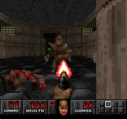

# Example #12B: Kill Count
Killing demons is not necessary to beating a level however, it does make it a lot easier to proceed through the map.  Each map in the Playstation set has three stacked achievements; one for beating the level, one for beating the level on Ultra-Violent (difficulty 4 of 4), and one for beating a map with 100% secrets and 100% kills.  As such the player will need to kill every demon on a map if they are going for a mastery of the game.  This leaderboard will track how many kills the player accumulates in one life for either Doom (maps 1-30) or Doom II (maps 31-54). <br>
<br>
```
// Doom
// #ID = 11256

// $077E10: Map ID
function MapId() => byte(0x077E10)

// $077dc8: Results Screen
//          01 = Activated (Also at Main Menu)
function ResultScreen() => byte(0x077dc8)

// $07814C: Game Timer 32-bit
//          (Reset to 0 when the game load a level)
function GameTimer() => dword(0x07814C)

// $078258: Current Difficulty
function Difficulty() => byte(0x078258)

// $08656A: Loading...
//          10= On screen
function Loading() => byte(0x08656A)

// $086763: [8-bit] Password Screen (0x64 = on password screen)
function PasswordScreen() => byte(0x086763)

// $09874d: Intermission Screen Background
//          01 = Activated
function IntermissionScreen() => byte(0x09874d)

// $098740: Last HUD Text ID (16-bit)
//          10b0 = All powerful mode on
//          10e0= Lots of goodies!
//          52c= You got the BFG9000!  Oh, yes.
//          5bc= You got the shotgun!
//          5d4= You got the supershotgun!
//          54c= You got the chaingun!
//          564= A chainsaw! Find some meat!
//          584= You got the rocket launcher!
//          5a4= You got the plasma gun!
function LastHudText() => word(0x098740)

// $098744: HUD Text Timer in screen
function HudTextTimerInScreen() => byte(0x098744)

// $0A8810: Current Health (16bits)
function Health() => word(0x0A8810)

// $0A88AC: Cheats
//          Bit1= God Mode
//          Bit2= Full Map
//          Bit3= Show All Things on the Map
//          Bit5= Level Warping
//          Bit7= Invisible Walls
function Cheats() => byte(0x0A88AC)

// $0a88b4: Total Kills (32-bit)
//          Reset when a level is loaded
function TotalKills() => dword(0x0a88b4)

/// Helper Functions ////////////////////////////////////////////////////////////

// Start when mapid = current map, no intermission or load screen, 
// on Hurt me Plenty difficulty or higher, and the game timer has started
function StartMap(map)
{
    return MapId() == map &&
        Difficulty() >= 2 &&
        ResultScreen() == 0 &&
        IntermissionScreen() == 0 &&
        prev(GameTimer()) == 0 && 
        GameTimer() == 2
}

// End when mapid = current map and the results screen is shown
function EndMap(map)
{
    return MapId() == map &&
        prev(ResultScreen()) == 0 && 
        ResultScreen() == 1
}

// Cancel when the loading screen appears, or any cheat are used
function GoodiesCheat() => HudTextTimerInScreen() == 1 && LastHudText() == 0x0010e0
function CheatsBitflags() => Cheats() != 0

// Submit when main menu is open
function MainMenu() => MapId() == 0x0

// Cancel when entering a password
function PasswordEntry()
{
    return PasswordScreen() == 0x64 && 
    prev(Loading()) != 0x10 && 
    Loading() == 0x10
}

// Submit when player dies
function Death() => Health() == 0x0

// Submit when main menu is open
function MainMenu() => MapId() == 0x0

// Level name constants
firstDoom1Level = 0x1
firstDoom2Level = 0x1f 
lastDoom1Level = 0x1e 
lastDoom2Level = 0x36

// Created a kill array to track if multiple monsters were killed at once
function KillCounter(killMax)
{
    killArray = []
    for index in range(0,killMax)
    {
       array_push(killArray, prev(TotalKills()) + index < TotalKills()) 
    }

    // Use the in-game timer for the time value
    return tally(2147483647, killArray)
}

/// Leaderboards ////////////////////////////////////////////////////////////
leaderboard
(
    "Ultimate Doom Slayer",
    "Most demons killed in one life starting from the first level of Ultimate Doom on Hurt Me Plenty or above",
    StartMap(firstDoom1Level),
    GoodiesCheat() || CheatsBitflags() || PasswordEntry(),
    Death() || MainMenu() || EndMap(lastDoom1Level),
    KillCounter(64),
    format = "VALUE",
    lower_is_better = false
)

leaderboard
(
    "Doom II Slayer",
    "Most demons killed in one life starting from the first level of Doom II on Hurt Me Plenty or above",
    StartMap(firstDoom2Level),
    GoodiesCheat() || CheatsBitflags() || PasswordEntry(),
    Death() || MainMenu() || EndMap(lastDoom2Level),
    KillCounter(64),
    format = "VALUE",
    lower_is_better = false
)
```
# Counting Game Actions
These achievements uses the changes in the memory ```TotalKills()``` to count how many kills the player has accumulated. We could use the ```TotalKills()``` directly however, it is reset every level. So instead we count the total number of hits by how much the value ```TotalKills()``` changes each frame with the function ```KillCounter()```.  We can get an accurate count of kills by making an array of delta checks that will add a hit if the kills has gone up by 1 or more, 2 or more, …, to ```maxKills``` or more each frame.   The value of ```maxKills``` can be set to any value but it should be high enough that it will account for the player killing multiple demons in the same frame with a large explosion.
## Start Event 
The function ```StartMap()``` is used to prime the leaderboard.  In this case we only want to start on map ID 0x1 for Doom or map ID 0x1f for Doom II.  The event also checks that the player is on difficulty Hurt Me Plenty or higher, we are not on the result or intermission screen, and when the internal game timer steps from 0 to 2.
## Cancel Event
The leaderboard will cancel if the player enables any cheats or starts entering a password.
## Submit Event
The leaderboard will submit on death, exiting to the main menu, or by beating the last map ID 0x1e for Doom or map ID 0x36 for Doom II.
## Value
The value submitted is a running count of the total kills using the ```KillCounter()``` function.  
## Lower is Better?
In this case ```lower_is_better = false``` is used since we want to order the leaderboard from most kills to least kills.
## Format
The format for these leaderboards is “VALUE” since we want to display the actual value of the number of monsters killed by the player.
### Script
[Example #12B script](Example_12B.rascript) <br>
### Links
[Tutorial #12](readme.md) <br>
[Example #12A](Example_12A.md) <br>
Example #12B <br>
[Example #12C](Example_12C.md)