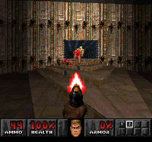

# Example #12C: Game Speedruns
While improving speeds on individual maps will improve your overall time the ultimate speedrun challenge is a full game play through. 
 
# Homework #12
Create a leaderboard from the beginning map to the last map for both Doom and Doom II.
## Useful Memory
You need to use the map ID at byte 0x077E10 to complete the homework. Here’s the values for all the maps:
| ID | Name | Notes |
|:----:|-----------------------------------|-----------------------------------|
| 0x0 | Main Menu | Show Map the title screen |
| 0x1 | Hangar | First Map of Doom |
| 0x2 | Plant |  |
| 0x3 | Toxin Refinery |  |
| 0x4 | Command Control |  |
| 0x5 | Phobos Lab |  |
| 0x6 | Central Processing |  |
| 0x7 | Computer Station |  |
| 0x8 | Phobos Anomaly |  |
| 0x9 | Deimos Anomaly |  |
| 0xA | Containment Area |  |
| 0xB | Refinery |  |
| 0xC | Deimos Lab |  |
| 0xD | Command Center |  |
| 0xE | Halls of the Damned |  |
| 0xF | Spawning Vats |  |
| 0x10 | Hell Gate |  |
| 0x11 | Hell Keep |  |
| 0x12 | Pandemonium |  |
| 0x13 | House of Pain |  |
| 0x14 | Unholy Cathedral |  |
| 0x15 | Mt. Erebus |  |
| 0x16 | Limbo |  |
| 0x17 | Tower of Babel |  |
| 0x18 | Hell Beneath |  |
| 0x19 | Perfect Hatred |  |
| 0x1A | Sever the Wicked |  |
| 0x1B | Unruly Evil |  |
| 0x1C | Unto the Cruel |  |
| 0x1D | Twilight Descends |  |
| 0x1E | Threshold of Pain | Last Map of Doom |
| 0x1F | Entryway | First Map of Doom II |
| 0x20 | Underhalls |  |
| 0x21 | The Gantlet |  |
| 0x22 | The Focus |  |
| 0x23 | The Waste Tunnels |  |
| 0x24 | The Crusher |  |
| 0x25 | Dead Simple |  |
| 0x26 | Tricks and Traps |  |
| 0x27 | The Pit |  |
| 0x28 | Refueling Base |  |
| 0x29 | O of Destruction! |  |
| 0x2A | The Factory |  |
| 0x2B | The Inmost Dens |  |
| 0x2C | Suburbs |  |
| 0x2D | Tenements |  |
| 0x2E | The Courtyard |  |
| 0x2F | The Citadel |  |
| 0x30 | Nirvana |  |
| 0x31 | The Catacombs |  |
| 0x32 | Barrels of Fun |  |
| 0x33 | Bloodfalls |  |
| 0x34 | The Abandoned Mines |  |
| 0x35 | Monster Condo |  |
| 0x36 | Redemption Denied | Last Map of Doom II |
| 0x37 | Fortress of Mistery | Bonus Map |
| 0x38 | The Military Base | Bonus Map |
| 0x39 | The Marshes | Bonus Map |
| 0x3A | The Mansion | Bonus Map |
| 0x3B | Club Doom | Bonus Map |
### Solution
[Tutorial #12 Solution](./Solution/readme.md) 
### Links
[Tutorial #12](readme.md) 
[Example #12A](Example_12A.md) 
[Example #12B](Example_12B.md) 
Example #12C