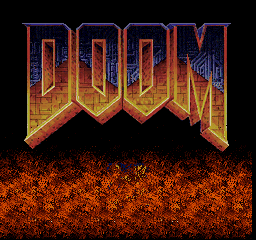

# Tutorial #12 – Leaderboards
## Overview
This tutorial will show a few examples of making leaderboards for the game [Doom](https://retroachievements.org/game/11256). Doom is an extremely popular first person shooter that was ported to many systems and still has the strong fan base to this day.  The main reason why Doom was selected for this tutorial is that it was one of the first games to have speedrun competitions.   Doom can record gameplay from user inputs making a small file that can be replayed on any computer with doom installed.  This prompted players to record how quickly they could finish a level and upload the recording to compare with other players.  Eventually, various categories of Doom speedruns were defined and the speedrun community grew and expanded to other games.<br>
<br>
 
## Leaderboards
Leaderboards are a ranked global list of players and game statistics.  Leaderboards can be based on internal game memory or condition hit counts.  There are many types of leaderboards already on RetroAchievements and some the most common are:
* Speedruns – Fastest time to complete an objective (level speedrun Example #12A and game speedrun Example #12C)
* Score Attack – Highest score achieved
* Action Count – How many times a player performs a certain action (kill count Example #12B)
## Game Events
Game events are a group of conditions used to determine when an important event occurs in the game.  It works best if game events have a delta check in them so that they only occur for one frame. The best way to build conditions for a game event is to create a series of test achievements for each game event you are interested in using, activate all the test achievements, check the box “Keep Active” to test for achievements that trigger more than expected, then play through the game normally while noting when achievements trigger.  Common game events include:
* Start Game
* Beat Game
* Start Level
* Beat Level
* On Title Screen
* Demo Mode
* Game Over
* Continue Used
* Lost Life
* Lost Health
### Start Event
The start event is a group of conditions used to prime a leaderboard.  Once the leaderboard is primed the user will be notified and the value of the leaderboard will be displayed. Multiple start events can be defined by putting each event into separate alts.
### Cancel Event
 The cancel event is a group of conditions used to stop a primed leaderboard.  When a leaderboard is canceled the value is not submitted and the player is notified that they failed the leaderboard. Multiple cancel events can be defined by putting each event into separate alts.
### Submit Event
The cancel event is a group of conditions used to submit the value of a primed leaderboard.  When a leaderboard is submitted the value is recorded to the site and the player is notified that they completed the leaderboard. Multiple submit events can be defined by putting each event into separate alts.
## Leaderboard Value
The leaderboard value is what gets submitted to the website when successfully completing a leaderboard.  The value can be an internal memory, a combination of memory values (ie. score memory is BCD and needs to be converted to a decimal value), or a count of hits.  If it can be measured then it can be used as a valued board value.
## Lower is Better?
The ```lower_is_better``` setting effects how the leaderboards is sorted.  If true then the leaderboard will be sorted by putting the player with the lowest score in the #1 ranking.  If false then the leaderboard will be sorted by putting the player with the highest score in the #1 ranking.  If you accidently set ```lower_is_better``` to the wrong value then you can change it later and the leaderboard will resort the entries accordingly.
## Format
The format setting only effects how the value is displayed and not the base value submitted. If you accidently set the ```format``` to the wrong value then you can change it later and the leaderboard will displayed with the new ```format```.  See the [RATools Wiki](https://github.com/Jamiras/RATools/wiki/Leaderboard-Functions) for a list of possible formats.

### Links
Tutorial #12<br>
[Example #12A](Example_12A.md)<br>
[Example #12B](Example_12B.md)<br>
[Example #12C](Example_12C.md)